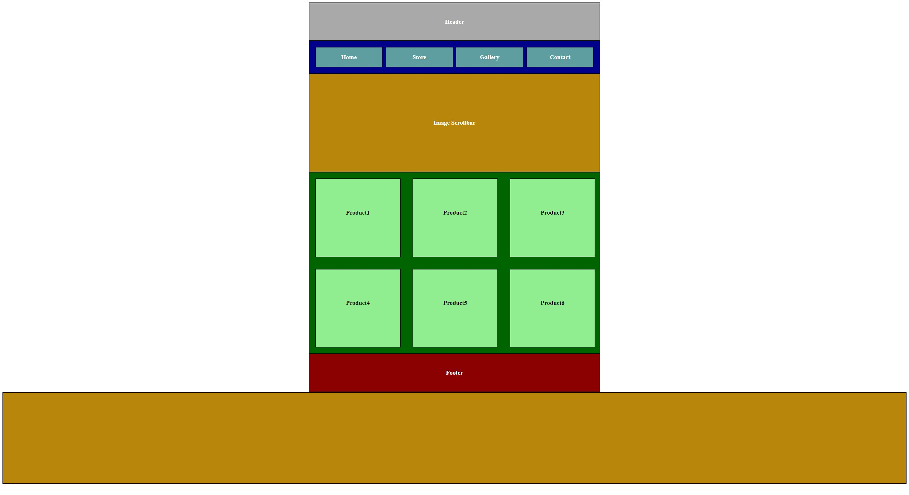
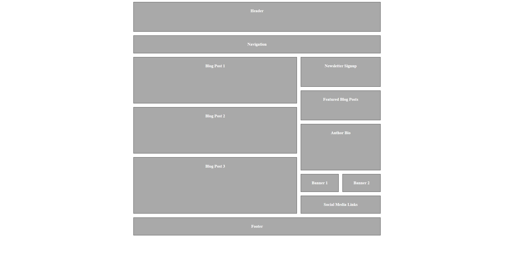
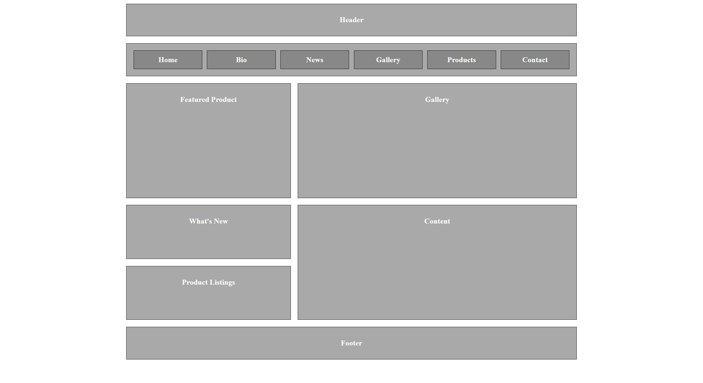
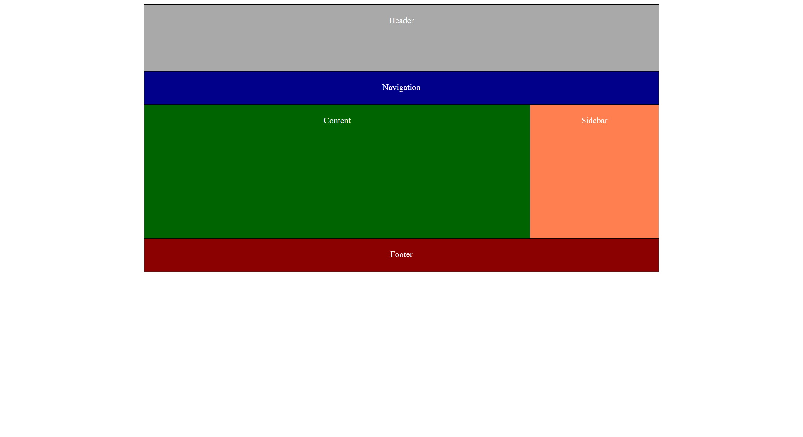

# CSS-Grid-Practice
This repository consists of CSS grid layouts, which helped me figure out where I was and master the CSS grid concept with ease.
Here are the demos of those layouts:
1. layout 1
  
1. layout 2
  
1. layout 3
  
1. layout 4
  
## To run this project locally, follow these steps:

1. Clone this repository to your local machine using `https://github.com/Pala-LakshmanSai/CSS-Grid-Practice.git`
2. Navigate to the project directory.
3. Open the index.html file in your web browser.

 ***Open for Contributions :)***
